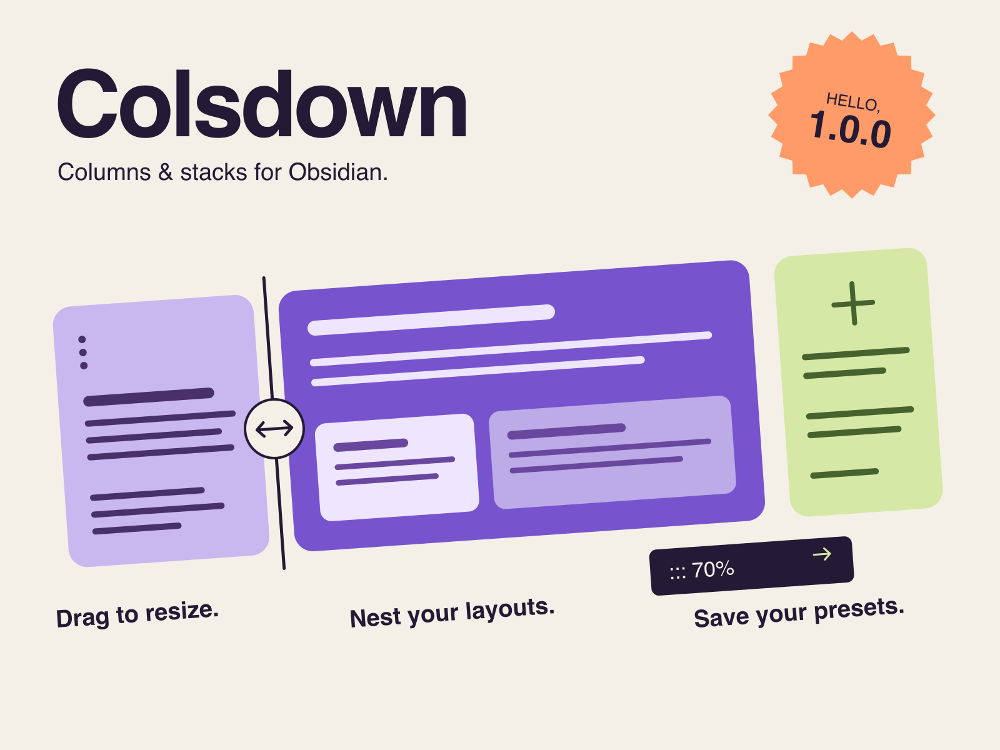
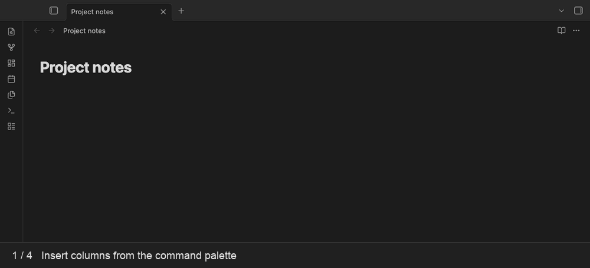

# Colsdown



Colsdown turns ordinary Markdown into responsive columns and vertical stacks in Obsidian. It uses Obsidian's renderer and your theme's styles, with a small resize handle between columns.

## What it does

- Renders fenced `colsdown` blocks as responsive columns in Reading View.
- Uses content before the first separator as the first column, so the opening `:::` marker is optional.
- Supports percentages, fractional widths, automatic columns, vertical `stack` blocks, nested layouts, and nested code fences.
- Collapses columns below a configurable container width without horizontal overflow.
- Provides commands for common layouts and settings for the separator, gap, minimum width, breakpoint, and divider.
- Resizes columns in Reading View in 5% steps and saves their widths into the note when you release the divider.
- Adds an auto-sized column containing “New column” with the **+** button; in Live Preview it sits immediately left of the code button.
- Saves named layout presets in settings and exposes each as an insertion command.
- Runs on desktop and mobile without runtime dependencies, network requests, or telemetry.

When adding a column to a layout with all widths set as percentages, existing columns shrink proportionally to make room for the new automatic column.

## Syntax

### Quick start

1. Run **Colsdown: Insert 2 columns** from the command palette.
2. Replace the placeholder text with your Markdown.
3. Switch to Reading View, hover the gap between columns, and drag.
4. Release the divider to save the new widths automatically.



Content before the first `:::` is the first column. A width on a later separator belongs to the column after it; the first column uses the remaining space.

`````markdown
````colsdown
Sidebar content

::: 70%

Main content

```javascript
console.log("Nested fences stay inside the column.");
```
````
`````

The example renders a 30/70 layout. For equal automatic columns, omit widths:

````markdown
```colsdown
First column

:::

Second column
```
````

Explicit markers before every column are also accepted:

````markdown
```colsdown
::: 25%
Navigation

::: 75%
Article
```
````

Use `fr` units when you want fractional tracks:

````markdown
```colsdown
::: 1fr
Small

::: 2fr
Large
```
````

Use a `stack` fence for vertically separated sections:

````markdown
```stack
:::
First section

:::
Second section
```
````

The separator can be changed in **Settings → Colsdown**. Colsdown recognizes the canonical `:::` separator as well as the configured separator, locks each block to the first separator it sees, and ignores marker-looking lines inside nested backtick or tilde fences.

## Resize columns

Hover the gap between adjacent columns, then left-click and drag the divider. On a touch screen, drag the visible divider. Movement snaps to 5 percentage-point steps of the available column space; gaps are excluded. Each adjusted column keeps at least 5%.

Widths save **once when you release**. The first resize converts that block's automatic or fractional widths to explicit percentages so the layout keeps its proportions when reopened. Other columns keep their displayed proportions; Markdown inside them stays unchanged.

You can also Tab to a divider and use the left/right arrow keys. Hold an arrow to preview multiple steps, then release it to save. Press Escape before releasing, or move keyboard focus away, to cancel.

Handles disappear when columns wrap onto multiple rows or stack in a narrow pane. Stacks and single-column blocks have no resize handles. Use Source Mode or Live Preview to edit widths directly at any time.

If the note changes during a gesture, or the rendered block cannot be mapped safely to one source block, Colsdown cancels the save and displays an error. This can happen with generated content or identical nested layouts. Reopen the note and try again, or edit its widths in Markdown. Reading-only saves write to the note directly; ordinary editor Undo is only available when the change goes through an open source editor.

If the same note is open in multiple Source Mode or Live Preview panes, close the extra editing panes before resizing. This keeps the save tied to one current editor buffer.

## Custom presets

Open **Settings → Colsdown → Presets → Add preset**:

1. Give it a name, such as **Research sidebar**.
2. Choose **Columns** or **Stack**.
3. Set each column's width individually, or leave it on **Auto**. Use percentages, numbers such as `30` for `30%`, or fractions such as `2fr`. Use **Add column** or **Add section** to grow the layout; the minus button removes a section.
4. Select **Save**. A checkmark beside the preset confirms it was saved.

Run **Colsdown: Insert preset: Research sidebar** to insert the layout at the cursor. Presets contain the layout and placeholder text. Edit or delete them from settings; their commands update immediately. Renaming a preset preserves its command ID and assigned hotkey.

Custom layouts and presets support 2–20 columns or sections. Percent-only widths must total 100%; mixed percentages must leave space for automatic or fractional columns. Invalid input shows an explanation and is not inserted or saved.

## Example layouts

Use the [demo note](demo/Colsdown%20test%20matrix.md) for copyable examples of automatic columns, sidebars, explicit widths, nested code fences, and stacks. Open the repository's `demo` folder as an Obsidian vault to try them.

## Obsidian modes

| Mode | Behavior |
| --- | --- |
| Reading View | Responsive rendered columns and stacks on desktop and mobile. |
| Live Preview | Editable fenced Markdown; note content remains unchanged. |
| Source Mode | Raw fenced Markdown only. |

## Commands

- **Colsdown: Insert 2 columns**
- **Colsdown: Insert 3 columns**
- **Colsdown: Insert 30/70 sidebar**
- **Colsdown: Insert stack**
- **Colsdown: Insert custom columns**

Every insertion is a normal editor change and can be undone.

## Installation

### Community plugins

Use this method after Colsdown is listed in Obsidian's Community Plugins directory:

1. Open **Settings → Community plugins**.
2. Select **Browse**, search for **Colsdown**, then select **Install**.
3. Select **Enable**.

### BRAT

Published releases and prereleases can be installed with [BRAT](https://github.com/TfTHacker/obsidian42-brat):

1. Install and enable **Obsidian42 - BRAT**.
2. Run **BRAT: Add a beta plugin for testing**.
3. Enter `grafanaKibana/obsidian-colsdown`.
4. Enable **Colsdown** under **Settings → Community plugins**.

BRAT can install only a published release or prerelease, not an unpublished draft.

### Manual installation

1. Download `main.js`, `manifest.json`, and `styles.css` from the same [GitHub release](https://github.com/grafanaKibana/obsidian-colsdown/releases).
2. Create `<Vault>/.obsidian/plugins/colsdown/`.
3. Copy the three files into that directory.
4. Reload Obsidian and enable **Colsdown**.

Do not mix assets from different releases.

## Troubleshooting

- **Fenced source instead of columns:** Enable Colsdown and switch to Reading View.
- **Columns are stacked:** Increase the layout's available width or lower the responsive breakpoint.
- **A marker does not split the block:** Put it on its own line and keep using the same separator throughout that block.
- **An inner code block closes Colsdown:** Make the outer fence longer than every matching fence inside it, or use tildes.
- **An embed or plugin block fails:** Test the same Markdown outside Colsdown first.
- **Widths were not saved:** Reopen the note to refresh its source mapping. Resolve conflicting edits in other panes, then retry.
- **Still stuck:** [Open an issue](https://github.com/grafanaKibana/obsidian-colsdown/issues) with a minimal source block, Obsidian version, theme, and related plugins.

## Development and releases

- [Contributing and local development](CONTRIBUTING.md)
- [Issues](https://github.com/grafanaKibana/obsidian-colsdown/issues)
- [Releases and changelog](https://github.com/grafanaKibana/obsidian-colsdown/releases)

Colsdown runs entirely inside Obsidian and makes no network requests. It collects no telemetry, requires no account or payment, shows no advertising, accesses only files inside the vault, and includes no closed-source components.

## License

[MIT](LICENSE)
